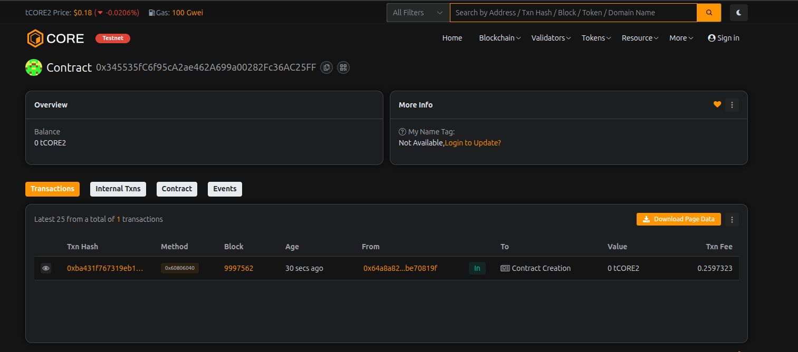

# EtherLend DAO

## Project Description

EtherLend DAO is a decentralized autonomous organization (DAO) that operates as a community-governed lending platform on the Ethereum blockchain. Members can stake ETH to join the DAO, participate in governance decisions through voting, request loans backed by collateral, and contribute to the treasury. The platform combines decentralized finance (DeFi) lending mechanisms with democratic governance, ensuring that all major decisions are made collectively by token-holding members.

The smart contract implements a transparent, trustless lending system where members can borrow funds from the DAO treasury by providing collateral, while lenders earn returns through interest payments. All lending parameters, fund allocations, and major decisions are subject to member voting, ensuring true decentralization and community control.

## Project Vision

Our vision is to democratize access to financial services by creating a fully decentralized lending platform that is:

- **Community-Governed**: Every member has a voice in the platform's direction through voting rights proportional to their stake
- **Transparent**: All transactions, proposals, and loan agreements are recorded on-chain and publicly verifiable
- **Accessible**: Lower barriers to entry for both borrowers and lenders compared to traditional financial institutions
- **Trustless**: Smart contract automation eliminates the need for intermediaries and reduces counterparty risk
- **Sustainable**: Interest from loans and member contributions grow the treasury, creating a self-sustaining ecosystem

We aim to build a financial system where individuals have true ownership and control over their assets while benefiting from collective decision-making and pooled resources.

## Key Features

### 1. **DAO Membership System**
   - Stake ETH to become a voting member
   - Voting power proportional to staked amount
   - Members receive governance rights and lending privileges

### 2. **Governance & Voting**
   - Create proposals for fund allocation, parameter changes, and platform improvements
   - Democratic voting mechanism with transparent vote counting
   - Time-locked voting periods with automatic execution of approved proposals

### 3. **Collateralized Lending**
   - Request loans from the DAO treasury with ETH collateral
   - Flexible interest rates and loan durations
   - Minimum 50% collateral requirement for risk management

### 4. **Treasury Management**
   - Community-controlled treasury funded by member stakes and deposits
   - Interest payments from loans grow the treasury
   - Transparent fund tracking and allocation through proposals

### 5. **Decentralized Decision Making**
   - All major decisions require member approval
   - Proposal system for suggesting changes and improvements
   - No single point of control or authority

## Future Scope

### Short-term Enhancements
- **Multi-token Support**: Accept various ERC-20 tokens as collateral
- **Credit Scoring System**: Implement on-chain reputation system for borrowers
- **Automated Liquidation**: Smart contract-based collateral liquidation for defaulted loans
- **Interest Rate Oracle**: Dynamic interest rates based on market conditions

### Medium-term Goals
- **Cross-chain Integration**: Expand to multiple blockchain networks (Polygon, Arbitrum, BSC)
- **NFT Collateral**: Accept valuable NFTs as loan collateral
- **Liquidity Pools**: Create liquidity mining opportunities for lenders
- **Mobile dApp**: Develop mobile applications for iOS and Android

### Long-term Vision
- **Institutional Partnerships**: Integration with traditional finance institutions
- **Insurance Protocol**: Implement loan insurance mechanisms to protect lenders
- **AI-powered Risk Assessment**: Machine learning models for loan approval and risk management
- **Global Expansion**: Localized versions with fiat on/off ramps in multiple countries
- **DAO Treasury Investments**: Diversify treasury into yield-generating DeFi protocols

### Technical Improvements
- **Gas Optimization**: Reduce transaction costs through code optimization
- **Layer 2 Integration**: Deploy on L2 solutions for faster, cheaper transactions
- **Advanced Security**: Multiple audits, bug bounties, and formal verification
- **Modular Architecture**: Upgradeable contracts with proxy patterns for future improvements

---

## Smart Contract Structure

### Core Functions

1. **joinDAO()**: Stake ETH to become a DAO member with voting rights
2. **createProposal()**: Submit governance proposals for member voting
3. **voteOnProposal()**: Cast votes on active proposals
4. **requestLoan()**: Apply for loans with collateral backing
5. **depositToTreasury()**: Contribute funds to grow the DAO treasury

### Installation & Deployment

```bash
# Clone the repository
git clone https://github.com/yourusername/EtherLendDAO.git
cd EtherLendDAO

# Install dependencies (if using Hardhat/Truffle)
npm install

# Compile contracts
npx hardhat compile

# Deploy to network
npx hardhat run scripts/deploy.js --network <network-name>
```

### Testing

```bash
# Run tests
npx hardhat test

# Check coverage
npx hardhat coverage
```

### Security Considerations

- Always audit smart contracts before mainnet deployment
- Implement timelocks for critical parameter changes
- Use multi-signature wallets for admin functions
- Regular security audits and bug bounty programs

### License

MIT License - See LICENSE file for details

### Contributing

We welcome contributions! Please see CONTRIBUTING.md for guidelines.

### Contact

- Website: [Coming Soon]
- Twitter: [@EtherLendDAO]
- Discord: [Community Link]
- Email: contact@etherlend.dao

---

**Disclaimer**: This is experimental software. Use at your own risk. Always do your own research before interacting with smart contracts.

---

## Contract Details:

Transaction id: 0x345535fC6f95cA2ae462A699a00282Fc36AC25FF
